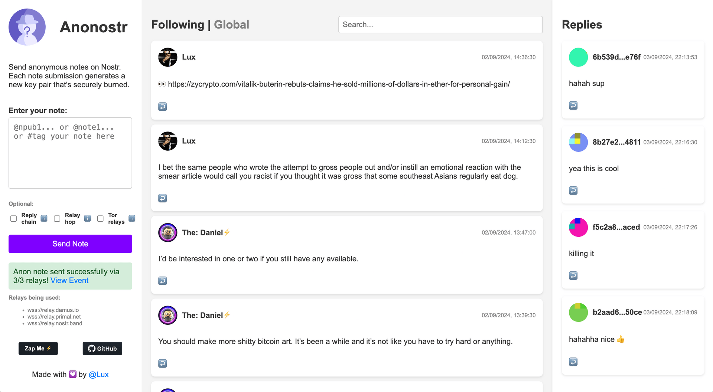

# Anonostr - Anonymous Nostr Client

**Anonostr** allows users to send anonymous notes to the [Nostr](https://nostr.com/) network without revealing their identity. For each note submission, the app generates a new key pair, sends the note through select relays, and then securely burns the key pair. It supports tagging, threading, quoting, and replying to existing notes.

## Features
- **Anonymous Note Sending**: Generates and burns a new key pair on each submission to ensure anonymity.
- **Tweetdeck View**: On desktop, get a column view with Global and Replies.
- **Follow People**: Follow your fav users without them knowing.
- **Replies Notifications**: Receive all replies to your anon notes.
- **Reply Chain**: Option to link notes in a threaded conversation for better context.
- **Relay Hop**: Adds obfuscation by spreading notes across different relays randomly.
- **Tor Relays**: Supports using onion service relays.
- **Tagging**: Supports hashtags and mentions within notes.
- **Progressive Web App (PWA)**: Installable on mobile and desktop, with offline capabilities.

## Usage
1. **Enter Your Note**: Write your note in the text area provided. You can mention other users or notes using [NIP-19](https://github.com/nostr-protocol/nips/blob/master/19.md) compatible identifiers such as `@npub...`, `@note...`, or `@nprofile...`.
2. **Enable Reply Chain (Optional)**: Check the "Reply chain" option to link your notes in a threaded conversation.
3. **Enable Relay Hop (Optional)**: Check the "Relay hop" option to make it harder for any single relay to correlate and track the notes.
4. **Enable Tor Relays (Optional)**: Check the "Tor relays" option to only use relays exposed through onion services.
5. **Send Note**: Click the "Send Note" button to publish your note anonymously to the Nostr network.
6. **View Note**: After submission, a link to view your note on [njump.me](https://njump.me/) will be provided.

## IPFS
Access the Anonostr web app through the decentralized IPFS network:

- https://white-sun-2491.on.fleek.co/

## Installation
You can install **Anonostr** as a Progressive Web App (PWA) on your mobile or desktop device:

1. Visit [Anonostr.com](https://anonostr.com/) using a compatible browser.
2. Follow the browser's instructions to install the app.

## Contributing
Contributions are welcome! Please follow these steps:

1. Fork the repository.
2. Create a new branch (`git checkout -b feature/YourFeature`).
3. Make your changes.
4. Commit your changes (`git commit -am 'Add some feature'`).
5. Push to the branch (`git push origin feature/YourFeature`).
6. Create a new Pull Request.

## Roadmap
- Support for DMs (kind 4)
- Bloom and/or media upload
- Zaps and reactions
- Search and event views
- Better styling on desktop

## Links
- **Live Demo**: [Anonostr.com](https://anonostr.com/)
- **Follow on GitHub**: [@Spl0itable](https://github.com/Spl0itable)

## Zap Me ⚡️
Support the project by zapping! Click the "Zap Me ⚡️" button in the app footer or send directly to `69420@walletofsatoshi.com`

## License
This project is licensed under the MIT License. See the [LICENSE](LICENSE) file for details.
